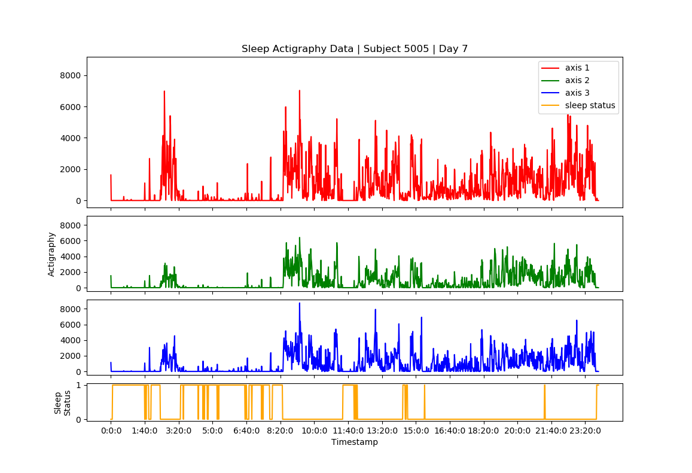
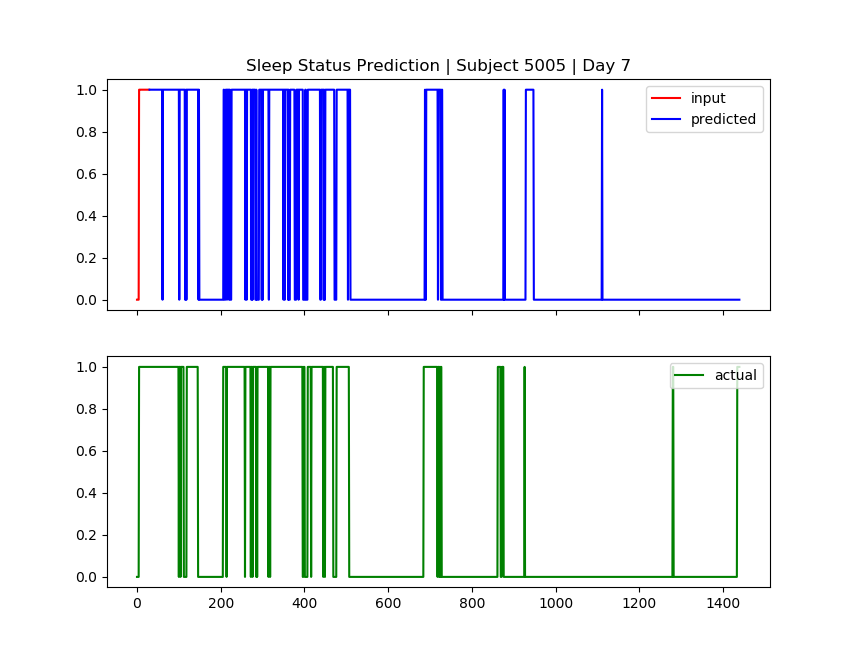
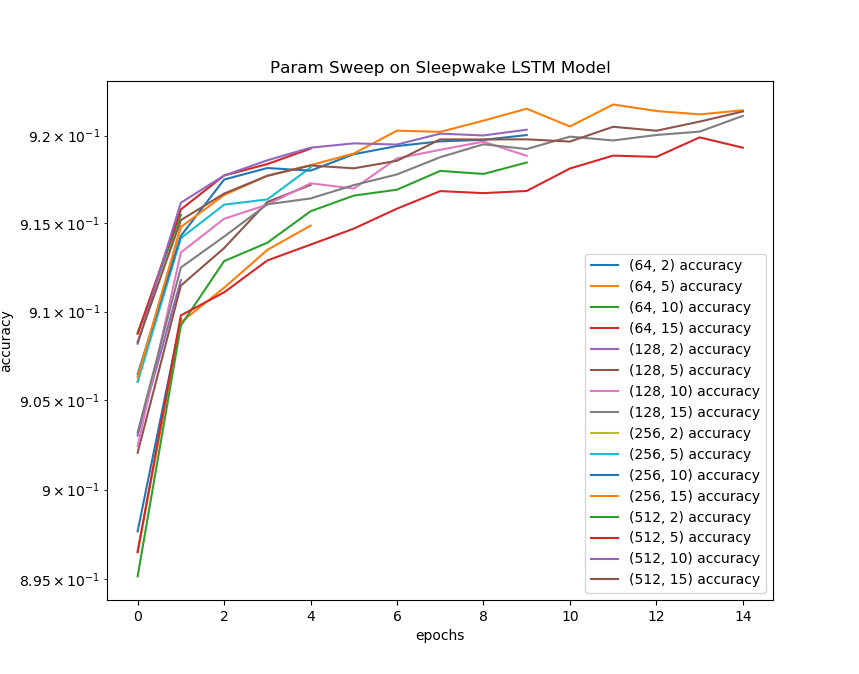

Sleep-Wake Prediction via Time Series LSTM Model
================================================

* Looking at sleep actigraphy data as a time series function makes the prediction of a dimension from the training data quite simple. For example, the image below shows the x, y, and z axes from the accelerometers and the sleep status (1=awake, 0=asleep). Sub-sampling all 4 dimensions together with a window size of 30 and looking specifically at sleep status per sub-sample will allow for a timer series preciction via an RNN or the LSTM achitecture.

Testing Trained Model on New Subject:
=====================================

|testing_example|

Sleep Status Prediction Results:
=================================

|testing_results_example|

|testing_results_accuracy|

Research for Datasets and Ideas
===============================

Research ideas will be documented here along with any useful datasets.

#. `Sleep-Wake Syndrome in Children from Screen Media Use`_

    * From the NIH database, this study evaluates how screen media relates to symptoms of sleep-wake disturbances.

#. `Sleep Stage Prediction via Consumer Wearable Device`_

    * From Oxford Academic, this study predicts the stages of sleep from a consumer wearable, such as an Apple / Android watch.

#. `PSG vs. Actigraphy`_

    * Sleep as Android compares actigraphy method of tracking sleep (as seen with smart watches) to polysomnography studies with EEG.

#. `Sleep-Wake Prediction`_

    * Sleep / Wake prediction and insomnia predictor using SVM and RF on labeled sleep actigraphy data.

#. `Sleep Stage Time Series via Deep Learning`_

    * Scores AASM's 5 key sleep stages using time-series Conv2D network. Datasets are publicly available.
 
#. `CNN-LSTM Sleep-Wake Prediction`_

    * DeepActi-Net CNN-LSTM model on sleep / wake classification.

.. _Sleep Stage Time Series via Deep Learning: https://arxiv.org/abs/1707.03321
.. _Sleep Stage Prediction via Consumer Wearable Device: https://academic.oup.com/sleep/article/42/12/zsz180/5549536
.. _Sleep-Wake Syndrome in Children from Screen Media Use: https://www.sciencedirect.com/science/article/abs/pii/S2352721820301935?via%3Dihub
.. _PSG vs. Actigraphy: https://sleep.urbandroid.org/sleep-lab-comparison/
.. _Sleep-Wake Prediction: https://www.ncbi.nlm.nih.gov/pmc/articles/PMC8206690/
.. _CNN-LSTM Sleep-Wake Prediction: https://www.mdpi.com/2079-9292/8/12/1461
